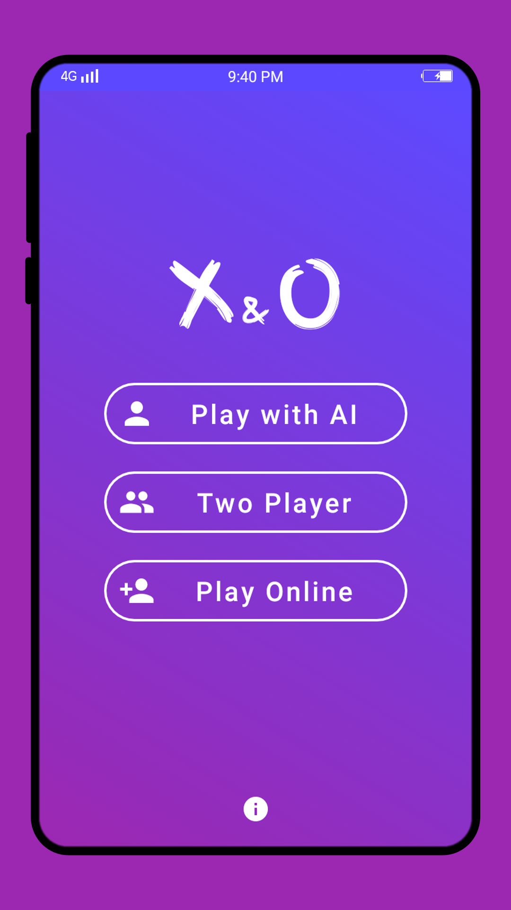
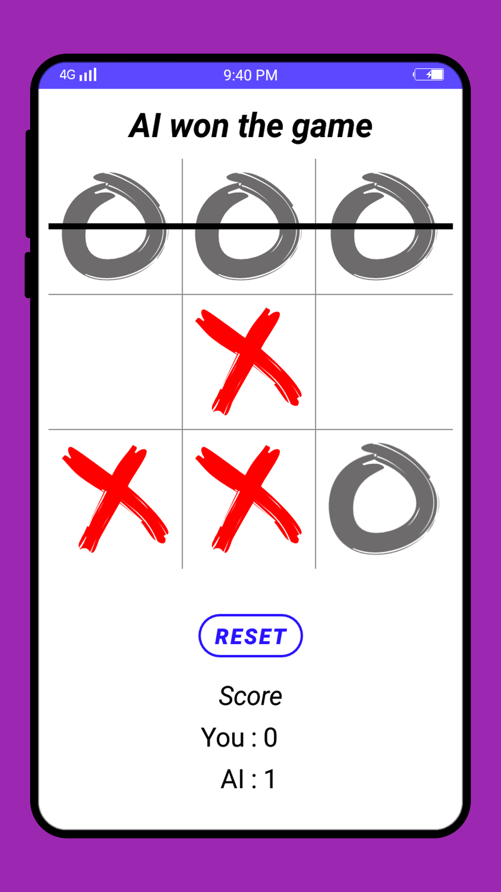
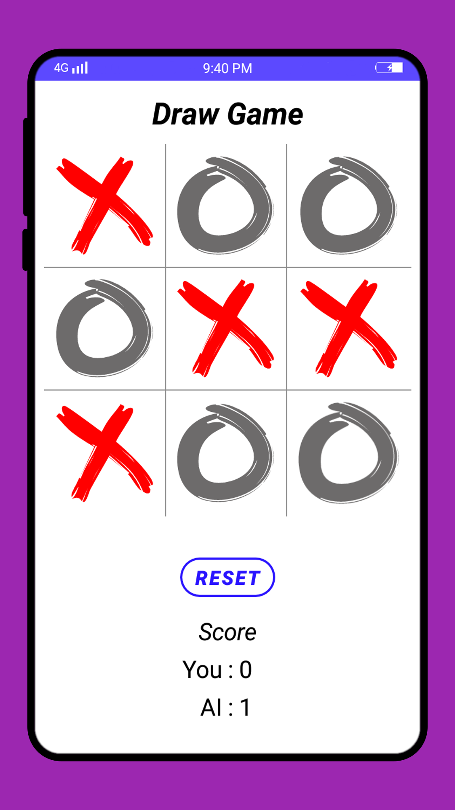
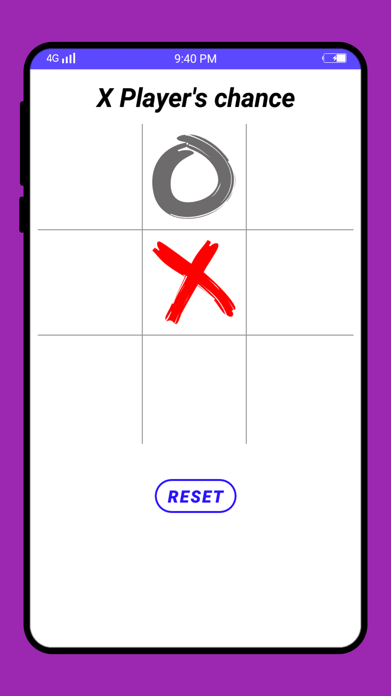
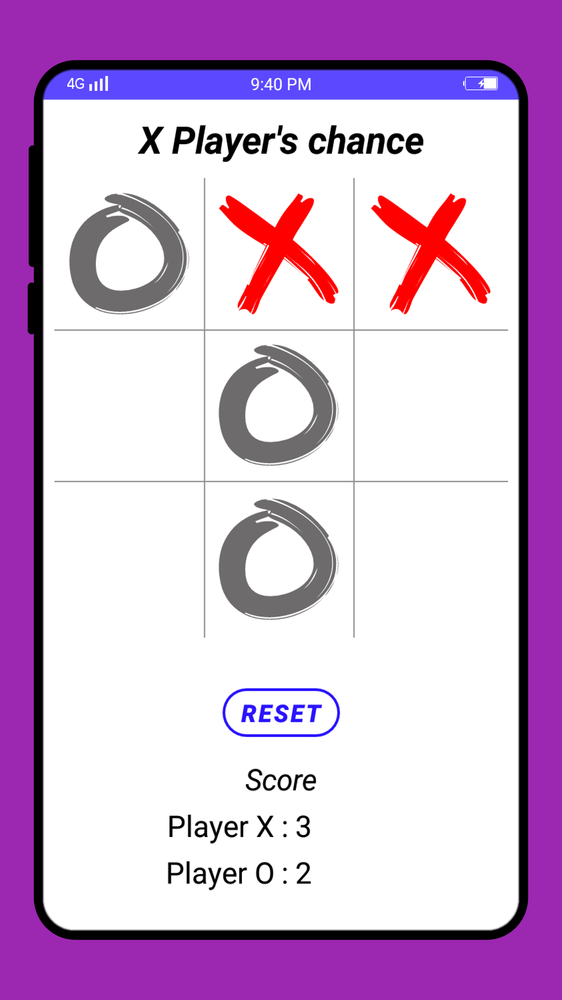
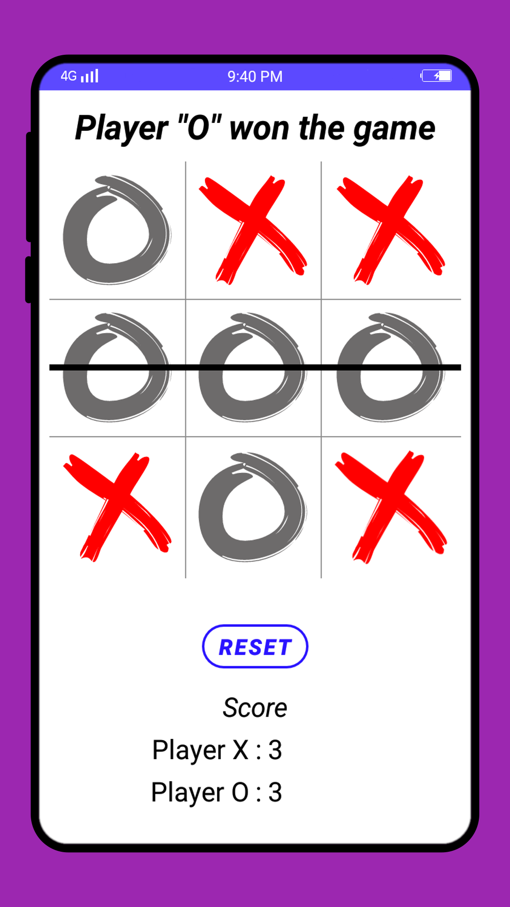
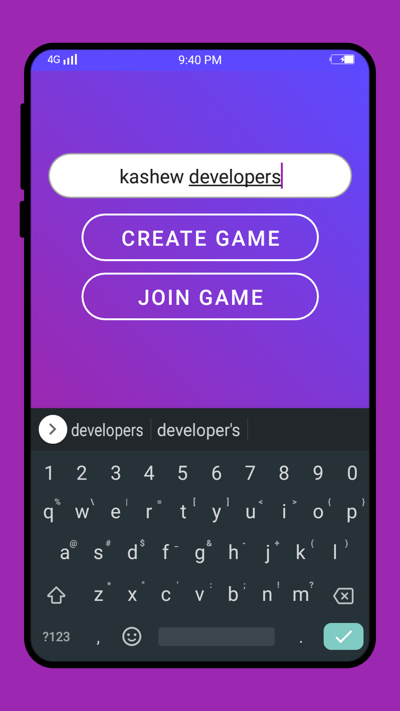
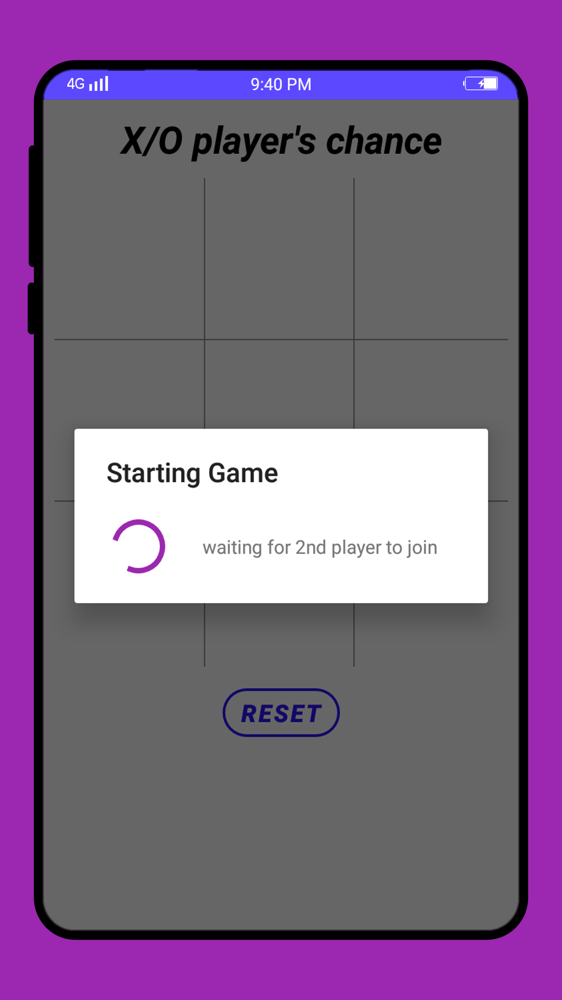

# X & O

----

<table>
    <tr>
        <th>Title</th>
        <td> X & O - Unbeatable AI</td>
    </tr>
    <tr>
        <th>Short description</th>
        <td>X & O play with the unbeatable AI or with your defeatable friends.</td>
    </tr>
    <tr>
        <th>Full description</th>
        <td> Simple X & O game. Play with the unbeatable AI. Or play with your friends. Or you can play with your friends online   This is an open source application. You can view its source code on github [kashew-developers/XO](https://github.com/kashew-developers/XO)</td>
    </tr>
    <tr>
        <th>YouTube</th>
        <td>https://youtu.be/HKBaAggyG9U</td>
    </tr>
</table>

----

#### Screenshots

<table>
    <tr>
        <td></td>
        <td></td>
        <td></td>
        <td></td>
    </tr>
    <tr>
        <td></td>
        <td></td>
        <td></td>
        <td></td>
    </tr>
</table>
